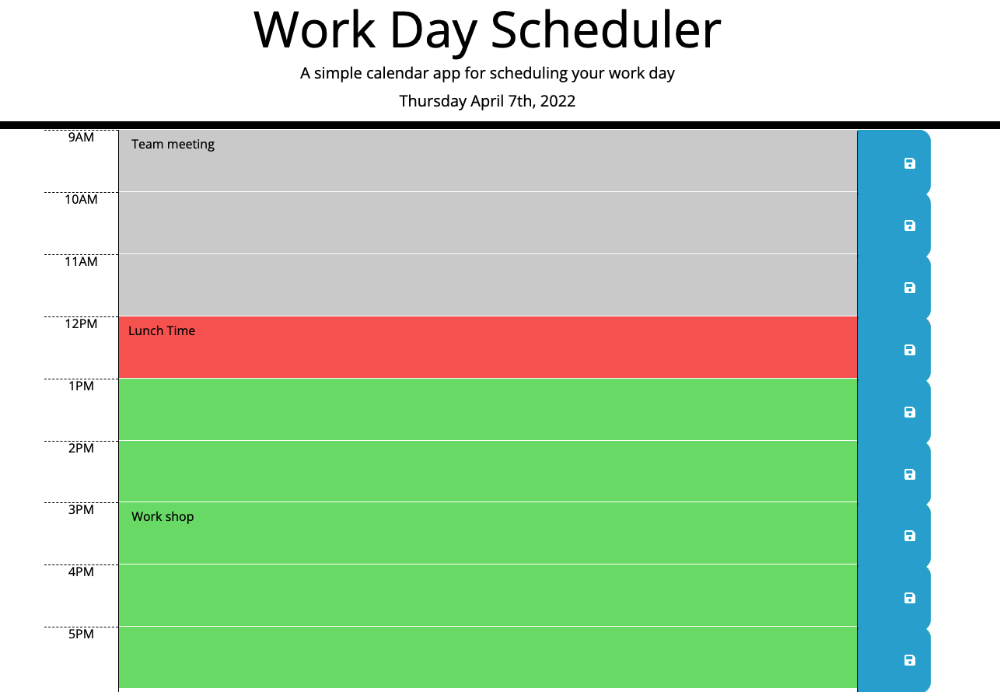

# Third-Party APIs: Work Day Scheduler Project

## Link 

### Please click [here](https://qd9069.github.io) to find the deployed project.


## Table of Contents

- [Link](#link)
- [Description](#description)
- [Usage](#usage)
- [Technology](#technology)
- [Assets](#assets)
- [Credits](#credits)


## Description

Welcome to the Work Day Scheduler application page!

This is a simple calendar app that helps you to manage your work day. You can use this app to scheudle your work, log any note or plan an event in your work day. All you need to do is write down your schedule and click on the save button to save it. Our app will save your schedule even after you refresh the page. 


The main purpose of this project is to practise my skills in JavaScript and jQuery. This project includes the use of Moment.js for time issue, Click-Events in jQuery, Dom-Traversal, as well as for loop, array, and local storage, etc.


## Usage

Here is a simple introduction for the Work Day Scheduler:
- The current day will be displayed at the top of the calendar
- Each timeblock is color coded to indicate whether it is in the past, present, or future: 
    - past - in grey color
    - present - in red color
    - future - in green color
- While clicking into a timeblock, you can enter an event there
- Click on the save button to save any event that you have entered
- The saved events persist after refreshing the page


## Technology

```md
- JavaScript
- jQuery
- HTML (partially provided in the starter code)
- CSS (provided in the starter code)
- Bootstrap (provided in the starter code)
```

## Assets

The following image demonstrates the web application's appearance and functionality:



---
## Credits

Original source code is from The Coding Boot Camp | UC San Diego Extension

Trilogy Education Services, LLC 🏆

